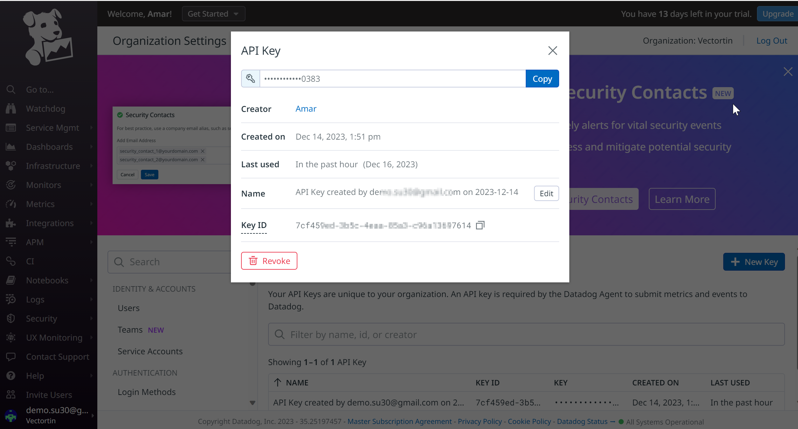

# Kuberentes monitoring by Datadog

## Reference documentation
- [Key concept of k8s architecture](https://www.datadoghq.com/blog/monitoring-kubernetes-era/)
- [Metrics to monitor and keep track of](https://www.datadoghq.com/blog/monitoring-kubernetes-performance-metrics/)
- [How to setup k8s monitoring using datadog tutorial](https://www.datadoghq.com/blog/monitoring-kubernetes-with-datadog/) 

## Utility
- [Password generator](https://www.passwordpal.net/password-generator.php)

## Steps to deploy datadog agent and its configuration

### [Configure permission and secrets](https://www.datadoghq.com/blog/monitoring-kubernetes-with-datadog/#configure-permissions-and-secrets)

#### Create ClusterRole, ClusterRoleBinding, and ServiceAccount
The following manifests create two sets of permissions: one for the Cluster Agent, which has specific permissions for collecting cluster-level metrics and Kubernetes events from the Kubernetes API, and a more limited set of permissions for the node-based Agent.
Deploying these two manifests will create: 
- ClusterRole
- ClusterRoleBinding
- ServiceAccount
for each flavor of Agent.
```
kubectl create -f "https://raw.githubusercontent.com/DataDog/datadog-agent/master/Dockerfiles/manifests/cluster-agent/cluster-agent-rbac.yaml"
kubectl create -f "https://raw.githubusercontent.com/DataDog/datadog-agent/master/Dockerfiles/manifests/cluster-agent/rbac.yaml"
```

#### Create secrets
Create a Kubernetes secret to provide your Datadog API key to the Agent without embedding the API key in your deployment manifests (which you may wish to manage in source control). To create the secret, run the following command using an [API key from your Datadog account](https://us5.datadoghq.com/organization-settings/api-keys):



```
kubectl create secret generic datadog-secret --from-literal api-key="<YOUR_API_KEY>"
```
#### Create secret token
Create a secret token to enable secure Agent-to-Agent communication between the Cluster Agent and the node-based Agents:
- Use password generator to get 32 character string.
- Now create base64 of it.
```
echo -n '<32_CHARACTER_LONG_STRING>' | base64
```
Use the resulting token to create a Kubernetes secret that both flavors of Agent will use to authenticate with each other:
```
kubectl create secret generic datadog-auth-token --from-literal=token=<TOKEN_FROM_PREVIOUS_STEP>
```

### Deploy the cluster agent
#### Copy the manifest to a local file and save it as [datadog-cluster-agent.yaml](datadog-cluster-agent.yaml)
The manifest creates a Kubernetes Deployment and Service for the Cluster Agent.
#### Apply the manifest
```
kubectl apply -f datadog-cluster-agent.yaml
```
#### Check that the Cluster Agent deployed successfully
```
kubectl get pods -l app=datadog-cluster-agent
```
Result:
```
NAME                                     READY   STATUS    RESTARTS   AGE
datadog-cluster-agent-7477d549ff-s42zx   1/1     Running   0          11s
```

Check the status of the datadog-cluster-agent.
```
kubectl exec -it datadog-cluster-agent-7477d549ff-s42zx datadog-cluster-agent status
```
In the output, you should be able to see that the Cluster Agent is successfully connecting to the Kubernetes API server to collect events and cluster status data, as shown in this example snippet:
```
  Running Checks
  ==============
  [...]    
    kubernetes_apiserver
    --------------------
      Instance ID: kubernetes_apiserver [OK]
      Configuration Source: file:/etc/datadog-agent/conf.d/kubernetes_apiserver.d/conf.yaml.default
      Total Runs: 4
      Metric Samples: Last Run: 0, Total: 0
      Events: Last Run: 0, Total: 52
      Service Checks: Last Run: 4, Total: 16
      Average Execution Time : 2.017s
```

### Deploy the node-based agent
#### Copy the manifest to a local file and save it as [datadog-agent.yaml](datadog-agent.yaml)
The manifest below builds on the standard Kubernetes Agent manifest to set two extra environment variables: DD_CLUSTER_AGENT_ENABLED (set to true), and DD_CLUSTER_AGENT_AUTH_TOKEN (set via Kubernetes secrets, just as in the manifest for the Cluster Agent)
#### Apply the manifest
```
kubectl create -f datadog-agent.yaml
```
#### Check that the node-based Agent deployed successfully
```
kubectl get daemonset datadog-agent
```
Output:
```
NAME            DESIRED   CURRENT   READY   UP-TO-DATE   AVAILABLE   NODE SELECTOR   AGE
datadog-agent   3         3         3       3            3           <none>          12m
```

Run the status command for any one of your node-based Agents to verify that the node-based Agents are successfully communicating with the Cluster Agent.
```
#kubectl get pods -l app=datadog-agent

NAME                  READY   STATUS    RESTARTS   AGE
datadog-agent-7vzqh   1/1     Running   0          27m
datadog-agent-kfvpc   1/1     Running   0          27m
datadog-agent-xvss5   1/1     Running   0          27m
```

Then use one of those pod names to query the Agent’s status:
```
kubectl exec -it datadog-agent-7vzqh agent status
```
